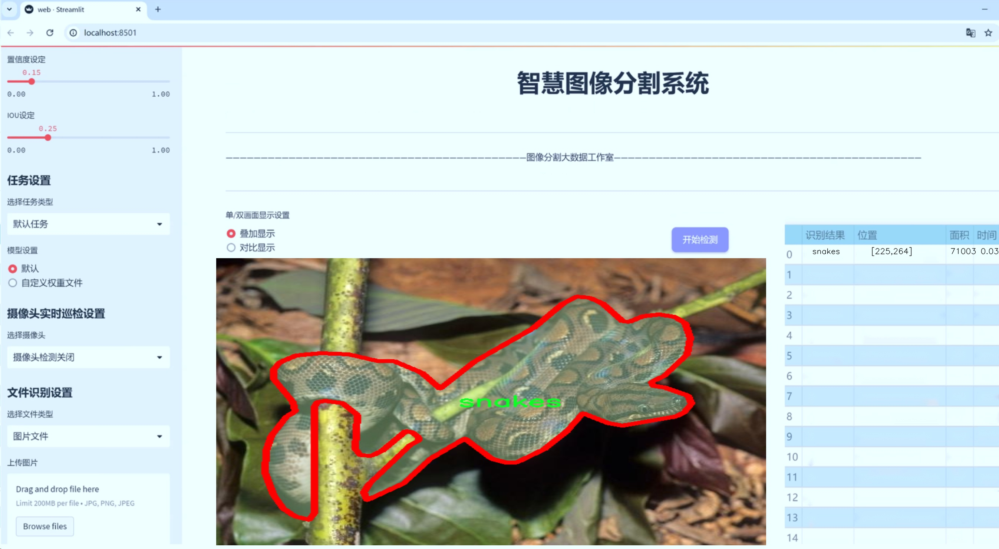

# 蛇类图像分割系统源码＆数据集分享
 [yolov8-seg-C2f-RFCBAMConv＆yolov8-seg-SPDConv等50+全套改进创新点发刊_一键训练教程_Web前端展示]

### 1.研究背景与意义

项目参考[ILSVRC ImageNet Large Scale Visual Recognition Challenge](https://gitee.com/YOLOv8_YOLOv11_Segmentation_Studio/projects)

项目来源[AAAI Global Al lnnovation Contest](https://kdocs.cn/l/cszuIiCKVNis)

研究背景与意义

随着计算机视觉技术的迅猛发展，图像分割作为其重要的研究方向之一，逐渐在多个领域中展现出巨大的应用潜力。尤其是在生物学、生态学及环境保护等领域，图像分割技术能够有效地帮助研究人员识别和分析生物物种，进而为物种保护和生态监测提供科学依据。蛇类作为生态系统中的重要组成部分，其种类繁多且在生态平衡中扮演着重要角色。然而，由于蛇类的隐蔽性和多样性，传统的人工识别方法不仅耗时耗力，而且容易受到主观因素的影响。因此，基于深度学习的自动化图像分割技术应运而生，成为解决这一问题的有效手段。

本研究旨在基于改进的YOLOv8模型，构建一个高效的蛇类图像分割系统。YOLO（You Only Look Once）系列模型以其高效的实时检测能力和较好的精度，已成为目标检测领域的主流方法之一。YOLOv8作为该系列的最新版本，结合了多种先进的技术，如特征金字塔网络（FPN）和自注意力机制，极大地提升了模型在复杂场景下的表现。然而，针对特定物种（如蛇类）的图像分割任务，现有的YOLOv8模型仍存在一定的局限性，特别是在细节处理和边缘识别方面。因此，改进YOLOv8模型以适应蛇类图像分割的需求，将是本研究的核心任务。

在数据集方面，本研究使用的蛇类图像数据集包含1000张图像，专注于单一类别——蛇类。这一数据集的构建为模型的训练和验证提供了坚实的基础。尽管数据量相对较小，但通过数据增强技术和迁移学习方法，可以有效提升模型的泛化能力和鲁棒性。此外，针对蛇类的特征，研究将探索如何通过改进模型架构和损失函数，使得分割结果更加精确，尤其是在蛇体的边缘和细节部分，从而提高整体的分割性能。

本研究的意义不仅在于提升蛇类图像分割的准确性和效率，更在于为生态保护和生物多样性研究提供一种新的技术手段。通过自动化的图像分割系统，研究人员能够快速、准确地获取蛇类的分布信息和种群动态，为生态监测和保护决策提供数据支持。此外，该系统的成功应用还将为其他生物物种的图像分割提供借鉴，推动计算机视觉技术在生物科学领域的广泛应用。

综上所述，基于改进YOLOv8的蛇类图像分割系统的研究，不仅具有重要的学术价值，也为实际生态保护工作提供了新的思路和方法。通过不断优化和完善该系统，期望能够为蛇类及其他生物的保护与研究贡献一份力量。

### 2.图片演示




##### 注意：由于此博客编辑较早，上面“2.图片演示”和“3.视频演示”展示的系统图片或者视频可能为老版本，新版本在老版本的基础上升级如下：（实际效果以升级的新版本为准）

  （1）适配了YOLOV8的“目标检测”模型和“实例分割”模型，通过加载相应的权重（.pt）文件即可自适应加载模型。

  （2）支持“图片识别”、“视频识别”、“摄像头实时识别”三种识别模式。

  （3）支持“图片识别”、“视频识别”、“摄像头实时识别”三种识别结果保存导出，解决手动导出（容易卡顿出现爆内存）存在的问题，识别完自动保存结果并导出到tempDir中。

  （4）支持Web前端系统中的标题、背景图等自定义修改，后面提供修改教程。

  另外本项目提供训练的数据集和训练教程,暂不提供权重文件（best.pt）,需要您按照教程进行训练后实现图片演示和Web前端界面演示的效果。

### 3.视频演示

[3.1 视频演示](https://www.bilibili.com/video/BV1ym2nYsESF/)

### 4.数据集信息展示

##### 4.1 本项目数据集详细数据（类别数＆类别名）

nc: 1
names: ['snakes']


##### 4.2 本项目数据集信息介绍

数据集信息展示

在本研究中，我们采用了名为“snakes”的数据集，以训练和改进YOLOv8-seg模型，旨在实现高效的蛇类图像分割系统。该数据集专注于蛇类的图像数据，具有独特的应用价值，尤其是在生物多样性保护、生态监测以及爬行动物行为研究等领域。数据集的设计和构建旨在为深度学习模型提供高质量的训练样本，从而提升模型在实际应用中的表现。

“snakes”数据集包含了丰富的蛇类图像，涵盖了不同种类、不同姿态以及不同环境下的蛇。这些图像不仅展现了蛇的多样性，还考虑到了不同光照条件、背景复杂度以及拍摄角度等因素。这种多样性确保了模型在面对真实世界中复杂场景时，能够保持良好的鲁棒性和准确性。数据集中蛇类的标注信息经过精细处理，确保每一张图像中的蛇体都被准确框定和分割，为模型的训练提供了可靠的监督信号。

该数据集的类别数量为1，具体类别为“snakes”。这一设计简化了模型的训练过程，使得研究者能够专注于蛇类的特征提取和分割算法的优化。尽管类别数量较少，但通过多样化的图像样本，模型仍然能够学习到丰富的特征表示。这种单一类别的聚焦使得模型在蛇类识别和分割任务上具备了更高的精度和效率，尤其是在特定领域的应用中。

在数据集的构建过程中，研究团队采用了多种数据增强技术，以扩展训练样本的多样性。这些技术包括随机裁剪、旋转、翻转、颜色变换等，旨在模拟蛇类在自然环境中的不同表现形式。通过这些增强手段，数据集不仅提高了样本的数量，还增强了模型的泛化能力，使其能够适应不同的应用场景。

此外，数据集的使用还考虑到了模型训练的效率和效果。为此，数据集的图像分辨率经过优化，以确保在保持图像质量的同时，降低计算资源的消耗。这一策略使得研究者能够在有限的计算资源下，进行更大规模的实验和模型调优，推动了蛇类图像分割技术的进步。

总之，“snakes”数据集为改进YOLOv8-seg的蛇类图像分割系统提供了坚实的基础。通过丰富的样本、多样化的增强策略以及高质量的标注信息，该数据集不仅提升了模型的训练效果，也为后续的研究提供了宝贵的数据支持。未来，随着数据集的不断扩展和优化，我们期待能够在蛇类图像分割领域取得更为显著的成果，为生态保护和生物研究贡献力量。


### 5.全套项目环境部署视频教程（零基础手把手教学）

[5.1 环境部署教程链接（零基础手把手教学）](https://www.bilibili.com/video/BV1jG4Ve4E9t/?vd_source=bc9aec86d164b67a7004b996143742dc)


[5.2 安装Python虚拟环境创建和依赖库安装视频教程链接（零基础手把手教学）](https://www.bilibili.com/video/BV1nA4VeYEze/?vd_source=bc9aec86d164b67a7004b996143742dc)

### 6.手把手YOLOV8-seg训练视频教程（零基础小白有手就能学会）

[6.1 手把手YOLOV8-seg训练视频教程（零基础小白有手就能学会）](https://www.bilibili.com/video/BV1cA4VeYETe/?vd_source=bc9aec86d164b67a7004b996143742dc)


按照上面的训练视频教程链接加载项目提供的数据集，运行train.py即可开始训练



     Epoch   gpu_mem       box       obj       cls    labels  img_size
     1/200     0G   0.01576   0.01955  0.007536        22      1280: 100%|██████████| 849/849 [14:42<00:00,  1.04s/it]
               Class     Images     Labels          P          R     mAP@.5 mAP@.5:.95: 100%|██████████| 213/213 [01:14<00:00,  2.87it/s]
                 all       3395      17314      0.994      0.957      0.0957      0.0843

     Epoch   gpu_mem       box       obj       cls    labels  img_size
     2/200     0G   0.01578   0.01923  0.007006        22      1280: 100%|██████████| 849/849 [14:44<00:00,  1.04s/it]
               Class     Images     Labels          P          R     mAP@.5 mAP@.5:.95: 100%|██████████| 213/213 [01:12<00:00,  2.95it/s]
                 all       3395      17314      0.996      0.956      0.0957      0.0845

     Epoch   gpu_mem       box       obj       cls    labels  img_size
     3/200     0G   0.01561    0.0191  0.006895        27      1280: 100%|██████████| 849/849 [10:56<00:00,  1.29it/s]
               Class     Images     Labels          P          R     mAP@.5 mAP@.5:.95: 100%|███████   | 187/213 [00:52<00:00,  4.04it/s]
                 all       3395      17314      0.996      0.957      0.0957      0.0845


### 7.50+种全套YOLOV8-seg创新点代码加载调参视频教程（一键加载写好的改进模型的配置文件）

[7.1 50+种全套YOLOV8-seg创新点代码加载调参视频教程（一键加载写好的改进模型的配置文件）](https://www.bilibili.com/video/BV1Hw4VePEXv/?vd_source=bc9aec86d164b67a7004b996143742dc)

### 8.YOLOV8-seg图像分割算法原理

原始YOLOv8-seg算法原理

YOLOv8-seg是2023年由Ultralytics推出的一款新型目标检测与分割模型，它在YOLO系列的基础上进行了诸多创新和改进，旨在实现更高效的实时目标检测和分割。该模型的设计不仅继承了YOLO系列的优良传统，还融合了YOLOX、YOLOv6、YOLOv7及PP-YOLOE等算法的先进理念，特别是在Head标签分配和Loss计算方面与PP-YOLOE有着显著的相似性。这种集成的设计使得YOLOv8-seg在精度和速度上都达到了新的高度，为目标检测领域带来了革命性的影响。

YOLOv8-seg的网络结构主要由三个部分组成：Backbone、Neck和Head。Backbone部分负责特征提取，采用了CSPDarknet（Cross Stage Partial Darknet）结构，这一结构通过引入多个残差块有效地提升了特征提取的能力。与前代模型YOLOv5相比，YOLOv8-seg在特征提取模块中使用了C2f模块替代了C3模块。C2f模块的设计理念是将输入特征图分为两个分支，分别经过卷积层进行降维处理，这样的结构不仅增强了特征图的表达能力，还提高了梯度流的传递效率。此外，YOLOv8-seg还引入了快速空间金字塔池化（SPPF）结构，以提取不同尺度的特征，从而在减少模型参数和计算量的同时，提升了特征提取的效率。

在Neck部分，YOLOv8-seg采用了特征金字塔网络（FPN）与路径聚合网络（PAN）的结合，进一步优化了特征图的处理和压缩。这一结构通过多层卷积和池化操作，使得模型能够更好地融合来自不同层次的特征信息，从而提升目标检测的准确性和鲁棒性。值得注意的是，YOLOv8-seg在目标检测中采用了无锚框（Anchor-Free）的方法，直接预测目标的中心点及其宽高比例，这种创新的设计大大减少了Anchor框的数量，进而提高了检测速度和准确度。

在Head部分，YOLOv8-seg引入了任务对齐学习（Task Alignment Learning，TAL）的理念，通过解耦头的设计，将类别和位置特征的提取分为两个并行的分支。这种设计使得模型在处理分类和定位任务时能够更好地关注各自的特征，从而加快收敛速度并提高预测精度。特别是在处理复杂场景时，YOLOv8-seg能够有效地减少分类和定位之间的干扰，提高整体的检测性能。

此外，YOLOv8-seg在训练过程中对数据增强策略进行了优化，特别是在Mosaic数据增强的使用上进行了调整。虽然Mosaic增强能够提升模型的鲁棒性和泛化能力，但其在一定程度上可能会破坏数据的真实分布。因此，YOLOv8-seg在训练的最后阶段停止使用Mosaic增强，以确保模型能够更好地学习到真实数据的特征。

在实际应用中，YOLOv8-seg的高效性和准确性使其在各种目标检测任务中表现出色。以苹果采摘为例，利用YOLOv8-seg的视觉识别能力，自动检测和定位苹果，能够显著提高采摘机器人的工作效率。结合蚁群算法进行路径规划，进一步优化了自动采摘的效率，使得机器人能够在复杂的果园环境中快速而准确地完成任务。

总的来说，YOLOv8-seg通过一系列创新的设计和优化，成功地提升了目标检测和分割的性能，成为实时检测领域的佼佼者。其在特征提取、目标检测和任务对齐等方面的改进，不仅增强了模型的准确性和速度，也为后续的研究和应用提供了广阔的空间。随着YOLOv8-seg的不断发展和完善，未来在农业、安防、交通等多个领域的应用前景将更加广阔。


### 9.系统功能展示（检测对象为举例，实际内容以本项目数据集为准）

图9.1.系统支持检测结果表格显示

  图9.2.系统支持置信度和IOU阈值手动调节

  图9.3.系统支持自定义加载权重文件best.pt(需要你通过步骤5中训练获得)

  图9.4.系统支持摄像头实时识别

  图9.5.系统支持图片识别

  图9.6.系统支持视频识别

  图9.7.系统支持识别结果文件自动保存

  图9.8.系统支持Excel导出检测结果数据


### 10.50+种全套YOLOV8-seg创新点原理讲解（非科班也可以轻松写刊发刊，V11版本正在科研待更新）

#### 10.1 由于篇幅限制，每个创新点的具体原理讲解就不一一展开，具体见下列网址中的创新点对应子项目的技术原理博客网址【Blog】：


[10.1 50+种全套YOLOV8-seg创新点原理讲解链接](https://gitee.com/qunmasj/good)

#### 10.2 部分改进模块原理讲解(完整的改进原理见上图和技术博客链接)【此小节的图要是加载失败请移步原始博客查看，链接：https://blog.csdn.net/cheng2333333?type=blog】

### YOLOv8简介
#### Backbone
Darknet-53
53指的是“52层卷积”+output layer。

借鉴了其他算法的这些设计思想

借鉴了VGG的思想，使用了较多的3×3卷积，在每一次池化操作后，将通道数翻倍；

借鉴了network in network的思想，使用全局平均池化（global average pooling）做预测，并把1×1的卷积核置于3×3的卷积核之间，用来压缩特征；（我没找到这一步体现在哪里）


使用了批归一化层稳定模型训练，加速收敛，并且起到正则化作用。

    以上三点为Darknet19借鉴其他模型的点。Darknet53当然是在继承了Darknet19的这些优点的基础上再新增了下面这些优点的。因此列在了这里

借鉴了ResNet的思想，在网络中大量使用了残差连接，因此网络结构可以设计的很深，并且缓解了训练中梯度消失的问题，使得模型更容易收敛。

使用步长为2的卷积层代替池化层实现降采样。（这一点在经典的Darknet-53上是很明显的，output的长和宽从256降到128，再降低到64，一路降低到8，应该是通过步长为2的卷积层实现的；在YOLOv8的卷积层中也有体现，比如图中我标出的这些位置）

#### 特征融合

模型架构图如下

  Darknet-53的特点可以这样概括：（Conv卷积模块+Residual Block残差块）串行叠加4次

  Conv卷积层+Residual Block残差网络就被称为一个stage


上面红色指出的那个，原始的Darknet-53里面有一层 卷积，在YOLOv8里面，把一层卷积移除了

为什么移除呢？

        原始Darknet-53模型中间加的这个卷积层做了什么？滤波器（卷积核）的个数从 上一个卷积层的512个，先增加到1024个卷积核，然后下一层卷积的卷积核的个数又降低到512个

        移除掉这一层以后，少了1024个卷积核，就可以少做1024次卷积运算，同时也少了1024个3×3的卷积核的参数，也就是少了9×1024个参数需要拟合。这样可以大大减少了模型的参数，（相当于做了轻量化吧）

        移除掉这个卷积层，可能是因为作者发现移除掉这个卷积层以后，模型的score有所提升，所以才移除掉的。为什么移除掉以后，分数有所提高呢？可能是因为多了这些参数就容易，参数过多导致模型在训练集删过拟合，但是在测试集上表现很差，最终模型的分数比较低。你移除掉这个卷积层以后，参数减少了，过拟合现象不那么严重了，泛化能力增强了。当然这个是，拿着你做实验的结论，反过来再找补，再去强行解释这种现象的合理性。


通过MMdetection官方绘制册这个图我们可以看到，进来的这张图片经过一个“Feature Pyramid Network(简称FPN)”，然后最后的P3、P4、P5传递给下一层的Neck和Head去做识别任务。 PAN（Path Aggregation Network）


“FPN是自顶向下，将高层的强语义特征传递下来。PAN就是在FPN的后面添加一个自底向上的金字塔，对FPN补充，将低层的强定位特征传递上去，

FPN是自顶（小尺寸，卷积次数多得到的结果，语义信息丰富）向下（大尺寸，卷积次数少得到的结果），将高层的强语义特征传递下来，对整个金字塔进行增强，不过只增强了语义信息，对定位信息没有传递。PAN就是针对这一点，在FPN的后面添加一个自底（卷积次数少，大尺寸）向上（卷积次数多，小尺寸，语义信息丰富）的金字塔，对FPN补充，将低层的强定位特征传递上去，又被称之为“双塔战术”。

FPN层自顶向下传达强语义特征，而特征金字塔则自底向上传达强定位特征，两两联手，从不同的主干层对不同的检测层进行参数聚合,这样的操作确实很皮。
#### 自底向上增强


而 PAN（Path Aggregation Network）是对 FPN 的一种改进，它的设计理念是在 FPN 后面添加一个自底向上的金字塔。PAN 引入了路径聚合的方式，通过将浅层特征图（低分辨率但语义信息较弱）和深层特征图（高分辨率但语义信息丰富）进行聚合，并沿着特定的路径传递特征信息，将低层的强定位特征传递上去。这样的操作能够进一步增强多尺度特征的表达能力，使得 PAN 在目标检测任务中表现更加优秀。


### Gold-YOLO简介
YOLO系列模型面世至今已有8年，由于其优异的性能，已成为目标检测领域的标杆。在系列模型经过十多个不同版本的改进发展逐渐稳定完善的今天，研究人员更多关注于单个计算模块内结构的精细调整，或是head部分和训练方法上的改进。但这并不意味着现有模式已是最优解。

当前YOLO系列模型通常采用类FPN方法进行信息融合，而这一结构在融合跨层信息时存在信息损失的问题。针对这一问题，我们提出了全新的信息聚集-分发（Gather-and-Distribute Mechanism）GD机制，通过在全局视野上对不同层级的特征进行统一的聚集融合并分发注入到不同层级中，构建更加充分高效的信息交互融合机制，并基于GD机制构建了Gold-YOLO。在COCO数据集中，我们的Gold-YOLO超越了现有的YOLO系列，实现了精度-速度曲线上的SOTA。


精度和速度曲线（TensorRT7）


精度和速度曲线（TensorRT8）
传统YOLO的问题
在检测模型中，通常先经过backbone提取得到一系列不同层级的特征，FPN利用了backbone的这一特点，构建了相应的融合结构：不层级的特征包含着不同大小物体的位置信息，虽然这些特征包含的信息不同，但这些特征在相互融合后能够互相弥补彼此缺失的信息，增强每一层级信息的丰富程度，提升网络性能。

原始的FPN结构由于其层层递进的信息融合模式，使得相邻层的信息能够充分融合，但也导致了跨层信息融合存在问题：当跨层的信息进行交互融合时，由于没有直连的交互通路，只能依靠中间层充当“中介”进行融合，导致了一定的信息损失。之前的许多工作中都关注到了这一问题，而解决方案通常是通过添加shortcut增加更多的路径，以增强信息流动。

然而传统的FPN结构即便改进后，由于网络中路径过多，且交互方式不直接，基于FPN思想的信息融合结构仍然存在跨层信息交互困难和信息损失的问题。

#### Gold-YOLO：全新的信息融合交互机制


#### Gold-YOLO架构
参考该博客提出的一种全新的信息交互融合机制：信息聚集-分发机制(Gather-and-Distribute Mechanism)。该机制通过在全局上融合不同层次的特征得到全局信息，并将全局信息注入到不同层级的特征中，实现了高效的信息交互和融合。在不显著增加延迟的情况下GD机制显著增强了Neck部分的信息融合能力，提高了模型对不同大小物体的检测能力。

GD机制通过三个模块实现：信息对齐模块(FAM)、信息融合模块(IFM)和信息注入模块(Inject)。

信息对齐模块负责收集并对齐不同层级不同大小的特征

信息融合模块通过使用卷积或Transformer算子对对齐后的的特征进行融合，得到全局信息

信息注入模块将全局信息注入到不同层级中

在Gold-YOLO中，针对模型需要检测不同大小的物体的需要，并权衡精度和速度，我们构建了两个GD分支对信息进行融合：低层级信息聚集-分发分支(Low-GD)和高层级信息聚集-分发分支(High-GD)，分别基于卷积和transformer提取和融合特征信息。

此外,为了促进局部信息的流动，我们借鉴现有工作，构建了一个轻量级的邻接层融合模块，该模块在局部尺度上结合了邻近层的特征，进一步提升了模型性能。我们还引入并验证了预训练方法对YOLO模型的有效性，通过在ImageNet 1K上使用MAE方法对主干进行预训练，显著提高了模型的收敛速度和精度。


### 11.项目核心源码讲解（再也不用担心看不懂代码逻辑）

#### 11.1 ultralytics\models\yolo\classify\predict.py

以下是对给定代码的核心部分进行提炼和详细注释的结果：

```python
# 导入必要的库
import torch
from ultralytics.engine.predictor import BasePredictor
from ultralytics.engine.results import Results
from ultralytics.utils import DEFAULT_CFG, ops

class ClassificationPredictor(BasePredictor):
    """
    ClassificationPredictor类用于基于分类模型进行预测。
    该类继承自BasePredictor类，专门用于处理分类任务。
    """

    def __init__(self, cfg=DEFAULT_CFG, overrides=None, _callbacks=None):
        """初始化ClassificationPredictor，将任务设置为'分类'。"""
        super().__init__(cfg, overrides, _callbacks)  # 调用父类构造函数
        self.args.task = 'classify'  # 设置任务类型为分类

    def preprocess(self, img):
        """将输入图像转换为模型兼容的数据类型。"""
        # 如果输入不是torch.Tensor类型，则进行转换
        if not isinstance(img, torch.Tensor):
            img = torch.stack([self.transforms(im) for im in img], dim=0)  # 应用预处理转换
        # 将图像移动到模型所在的设备（CPU或GPU）
        img = (img if isinstance(img, torch.Tensor) else torch.from_numpy(img)).to(self.model.device)
        # 根据模型的精度要求转换数据类型（fp16或fp32）
        return img.half() if self.model.fp16 else img.float()  # uint8转换为fp16/32

    def postprocess(self, preds, img, orig_imgs):
        """对预测结果进行后处理，返回Results对象。"""
        # 如果原始图像不是列表，则将其转换为numpy数组
        if not isinstance(orig_imgs, list):
            orig_imgs = ops.convert_torch2numpy_batch(orig_imgs)

        results = []  # 存储结果的列表
        # 遍历每个预测结果
        for i, pred in enumerate(preds):
            orig_img = orig_imgs[i]  # 获取对应的原始图像
            img_path = self.batch[0][i]  # 获取图像路径
            # 创建Results对象并添加到结果列表中
            results.append(Results(orig_img, path=img_path, names=self.model.names, probs=pred))
        return results  # 返回处理后的结果列表
```

### 代码核心部分分析：
1. **类定义**：`ClassificationPredictor` 继承自 `BasePredictor`，专门用于分类任务。
2. **初始化方法**：构造函数中调用父类构造函数，并设置任务类型为分类。
3. **预处理方法**：`preprocess` 方法将输入图像转换为适合模型的格式，包括数据类型的转换和设备的迁移。
4. **后处理方法**：`postprocess` 方法处理模型的预测结果，生成包含原始图像、路径、类别名称和概率的 `Results` 对象。

### 代码注释：
- 每个方法都有详细的注释，解释其功能和实现细节，便于理解代码的逻辑和用途。

这个文件是Ultralytics YOLO项目中的一个Python模块，主要用于图像分类的预测。它定义了一个名为`ClassificationPredictor`的类，该类继承自`BasePredictor`，并专门用于处理基于分类模型的预测任务。

在文件的开头，首先导入了必要的库，包括`torch`，这是一个流行的深度学习框架。接着，从`ultralytics.engine.predictor`和`ultralytics.engine.results`模块中导入了`BasePredictor`和`Results`类，后者用于存储和处理预测结果。此外，还导入了`DEFAULT_CFG`和`ops`，它们在模型配置和操作中可能会用到。

`ClassificationPredictor`类的构造函数`__init__`初始化了预测器，并将任务类型设置为'分类'。在初始化过程中，它调用了父类`BasePredictor`的构造函数，并接受一些参数，如配置、覆盖选项和回调函数。

`preprocess`方法用于对输入图像进行预处理，以便将其转换为模型所需的数据类型。该方法首先检查输入是否为`torch.Tensor`类型，如果不是，则通过对每个图像应用转换函数来将其转换为张量。接着，将图像移动到模型所在的设备上（如GPU），并根据模型的浮点精度（fp16或fp32）将图像数据类型转换为相应的格式。

`postprocess`方法用于对模型的预测结果进行后处理，以返回`Results`对象。该方法首先检查原始图像是否为列表，如果不是，则将其转换为NumPy数组。然后，对于每个预测结果，方法会提取原始图像和图像路径，并将这些信息与预测概率一起存储在`Results`对象中，最终返回这些结果。

总体而言，这个模块提供了一个结构化的方式来进行图像分类预测，包含了图像的预处理和后处理步骤，使得用户能够方便地使用YOLO模型进行分类任务。通过示例代码，用户可以看到如何实例化`ClassificationPredictor`并使用其进行预测。

#### 11.2 ui.py

以下是经过简化和注释的核心代码部分：

```python
import sys
import subprocess

def run_script(script_path):
    """
    使用当前 Python 环境运行指定的脚本。

    Args:
        script_path (str): 要运行的脚本路径

    Returns:
        None
    """
    # 获取当前 Python 解释器的路径
    python_path = sys.executable

    # 构建运行命令，使用 streamlit 运行指定的脚本
    command = f'"{python_path}" -m streamlit run "{script_path}"'

    # 执行命令并等待其完成
    result = subprocess.run(command, shell=True)
    
    # 检查命令执行结果，如果返回码不为0，表示出错
    if result.returncode != 0:
        print("脚本运行出错。")

# 程序入口
if __name__ == "__main__":
    # 指定要运行的脚本路径
    script_path = "web.py"  # 这里可以直接指定脚本名，假设它在当前目录下

    # 调用函数运行脚本
    run_script(script_path)
```

### 代码注释说明：
1. **导入模块**：
   - `sys`：用于获取当前 Python 解释器的路径。
   - `subprocess`：用于执行外部命令。

2. **函数 `run_script`**：
   - 定义了一个函数，接受一个参数 `script_path`，表示要运行的脚本路径。
   - 使用 `sys.executable` 获取当前 Python 解释器的路径。
   - 构建一个命令字符串，使用 `streamlit` 模块运行指定的脚本。
   - 使用 `subprocess.run` 执行构建的命令，并等待其完成。
   - 检查命令的返回码，如果不为0，表示脚本运行出错，打印错误信息。

3. **程序入口**：
   - 使用 `if __name__ == "__main__":` 确保只有在直接运行该脚本时才会执行以下代码。
   - 指定要运行的脚本路径（在这里直接指定为 `"web.py"`）。
   - 调用 `run_script` 函数来执行指定的脚本。

这个程序文件的主要功能是使用当前的 Python 环境来运行一个指定的脚本，具体来说是一个名为 `web.py` 的脚本。程序首先导入了必要的模块，包括 `sys`、`os` 和 `subprocess`，以及一个自定义的路径处理模块 `abs_path`。

在 `run_script` 函数中，程序接受一个参数 `script_path`，这个参数是要运行的脚本的路径。函数首先获取当前 Python 解释器的路径，使用 `sys.executable` 获取当前 Python 环境的可执行文件路径。接着，程序构建了一个命令字符串，这个命令字符串使用了 `streamlit` 模块来运行指定的脚本。

然后，程序通过 `subprocess.run` 方法执行这个命令。`shell=True` 参数允许在 shell 中执行命令。执行后，程序检查返回的结果，如果返回码不为零，表示脚本运行出错，程序会打印出相应的错误信息。

在文件的最后部分，使用 `if __name__ == "__main__":` 来确保只有在直接运行该文件时才会执行下面的代码。在这里，程序指定了要运行的脚本路径 `web.py`，并调用 `run_script` 函数来执行这个脚本。

总体来说，这个程序的作用是提供一个简单的接口来运行 `web.py` 脚本，确保使用的是当前的 Python 环境，并能够处理可能出现的错误。

#### 11.3 ultralytics\nn\backbone\fasternet.py

以下是代码中最核心的部分，并附上详细的中文注释：

```python
import torch
import torch.nn as nn
from typing import List
from torch import Tensor

class Partial_conv3(nn.Module):
    """
    实现部分卷积的类，主要用于处理输入特征图的不同部分。
    """

    def __init__(self, dim, n_div, forward):
        super().__init__()
        self.dim_conv3 = dim // n_div  # 计算部分卷积的维度
        self.dim_untouched = dim - self.dim_conv3  # 计算未被卷积处理的维度
        self.partial_conv3 = nn.Conv2d(self.dim_conv3, self.dim_conv3, 3, 1, 1, bias=False)  # 定义卷积层

        # 根据选择的前向传播方式，定义前向传播函数
        if forward == 'slicing':
            self.forward = self.forward_slicing
        elif forward == 'split_cat':
            self.forward = self.forward_split_cat
        else:
            raise NotImplementedError

    def forward_slicing(self, x: Tensor) -> Tensor:
        # 仅用于推理阶段
        x = x.clone()  # 克隆输入以保持原始输入不变
        x[:, :self.dim_conv3, :, :] = self.partial_conv3(x[:, :self.dim_conv3, :, :])  # 对部分特征图进行卷积
        return x

    def forward_split_cat(self, x: Tensor) -> Tensor:
        # 用于训练和推理阶段
        x1, x2 = torch.split(x, [self.dim_conv3, self.dim_untouched], dim=1)  # 将输入分为两部分
        x1 = self.partial_conv3(x1)  # 对第一部分进行卷积
        x = torch.cat((x1, x2), 1)  # 将卷积后的部分与未处理部分拼接
        return x


class MLPBlock(nn.Module):
    """
    实现多层感知机（MLP）块的类。
    """

    def __init__(self, dim, n_div, mlp_ratio, drop_path, layer_scale_init_value, act_layer, norm_layer, pconv_fw_type):
        super().__init__()
        self.dim = dim
        self.mlp_ratio = mlp_ratio
        self.drop_path = nn.Identity() if drop_path <= 0 else DropPath(drop_path)  # 根据drop_path值选择是否使用DropPath
        self.n_div = n_div

        mlp_hidden_dim = int(dim * mlp_ratio)  # 计算MLP隐藏层的维度

        # 定义MLP的层
        mlp_layer: List[nn.Module] = [
            nn.Conv2d(dim, mlp_hidden_dim, 1, bias=False),
            norm_layer(mlp_hidden_dim),
            act_layer(),
            nn.Conv2d(mlp_hidden_dim, dim, 1, bias=False)
        ]

        self.mlp = nn.Sequential(*mlp_layer)  # 将MLP层组合成一个序列

        # 定义空间混合层
        self.spatial_mixing = Partial_conv3(dim, n_div, pconv_fw_type)

    def forward(self, x: Tensor) -> Tensor:
        shortcut = x  # 保存输入以便于残差连接
        x = self.spatial_mixing(x)  # 进行空间混合
        x = shortcut + self.drop_path(self.mlp(x))  # 添加残差连接并通过MLP
        return x


class FasterNet(nn.Module):
    """
    FasterNet模型的主类，包含多个阶段和特征提取层。
    """

    def __init__(self, in_chans=3, num_classes=1000, embed_dim=96, depths=(1, 2, 8, 2), mlp_ratio=2., n_div=4,
                 patch_size=4, patch_stride=4, patch_size2=2, patch_stride2=2, patch_norm=True, drop_path_rate=0.1,
                 layer_scale_init_value=0, norm_layer='BN', act_layer='RELU', pconv_fw_type='split_cat'):
        super().__init__()

        # 选择归一化层和激活函数
        norm_layer = nn.BatchNorm2d if norm_layer == 'BN' else NotImplementedError
        act_layer = nn.GELU if act_layer == 'GELU' else partial(nn.ReLU, inplace=True)

        self.num_stages = len(depths)  # 计算阶段数量
        self.embed_dim = embed_dim  # 嵌入维度
        self.mlp_ratio = mlp_ratio  # MLP比例
        self.depths = depths  # 各阶段的深度

        # 将输入图像分割为不重叠的补丁
        self.patch_embed = PatchEmbed(patch_size=patch_size, patch_stride=patch_stride, in_chans=in_chans,
                                      embed_dim=embed_dim, norm_layer=norm_layer if patch_norm else None)

        # 构建各个阶段
        stages_list = []
        for i_stage in range(self.num_stages):
            stage = BasicStage(dim=int(embed_dim * 2 ** i_stage), n_div=n_div, depth=depths[i_stage],
                               mlp_ratio=self.mlp_ratio, drop_path=[x.item() for x in torch.linspace(0, drop_path_rate, sum(depths))][sum(depths[:i_stage]):sum(depths[:i_stage + 1])],
                               layer_scale_init_value=layer_scale_init_value, norm_layer=norm_layer, act_layer=act_layer,
                               pconv_fw_type=pconv_fw_type)
            stages_list.append(stage)

            # 添加补丁合并层
            if i_stage < self.num_stages - 1:
                stages_list.append(PatchMerging(patch_size2=patch_size2, patch_stride2=patch_stride2,
                                                 dim=int(embed_dim * 2 ** i_stage), norm_layer=norm_layer))

        self.stages = nn.Sequential(*stages_list)  # 将所有阶段组合成一个序列

    def forward(self, x: Tensor) -> Tensor:
        # 输出四个阶段的特征，用于密集预测
        x = self.patch_embed(x)  # 通过补丁嵌入层
        outs = []
        for idx, stage in enumerate(self.stages):
            x = stage(x)  # 通过每个阶段
            if idx in [0, 2, 4, 6]:  # 选择输出的层
                norm_layer = getattr(self, f'norm{idx}')
                x_out = norm_layer(x)  # 归一化
                outs.append(x_out)  # 收集输出
        return outs
```

### 代码核心部分说明：
1. **Partial_conv3**: 这个类实现了部分卷积的功能，可以选择不同的前向传播方式（切片或拼接），用于特征图的处理。
2. **MLPBlock**: 这个类实现了多层感知机块，包含了卷积层、归一化层和激活函数，并且支持残差连接。
3. **FasterNet**: 这是整个模型的核心类，包含多个阶段的构建，处理输入图像并输出特征。它将输入图像分割为补丁，并通过多个阶段进行处理，最终输出特征图。

这些核心部分共同构成了FasterNet模型的基础结构，能够有效地进行特征提取和处理。

这个程序文件实现了一个名为FasterNet的深度学习模型，主要用于图像处理任务。代码首先导入了必要的库，包括PyTorch和一些其他的模块。接下来，定义了一些类和函数，构成了FasterNet模型的各个组件。

首先，`Partial_conv3`类实现了一个部分卷积层，可以选择不同的前向传播方式（切片或拼接）。这个类在模型中用于处理输入特征图的一部分，保持了原始输入以便后续的残差连接。

接着，`MLPBlock`类实现了一个多层感知机（MLP）模块，包含了两个卷积层和一个激活函数。它使用了`Partial_conv3`来进行空间混合，并在前向传播中实现了残差连接。这个模块可以选择性地使用层级缩放，以增强模型的表现。

`BasicStage`类则是由多个`MLPBlock`组成的基本阶段，负责处理输入特征并输出结果。每个阶段的深度和参数都可以根据需要进行配置。

`PatchEmbed`和`PatchMerging`类分别用于将输入图像划分为小块（patch）并进行合并。这种方法有助于减少计算量并提高模型的效率。

`FasterNet`类是整个模型的核心，负责初始化模型的各个部分，包括嵌入层、多个基本阶段和规范化层。它支持多种配置参数，如输入通道数、类别数、嵌入维度、各阶段的深度等。

在模型的前向传播中，输入图像首先经过嵌入层，然后依次通过各个阶段，最后输出多个阶段的特征图，以便进行密集预测。

此外，文件中还定义了一些函数，用于加载预训练权重并更新模型的权重。这些函数根据不同的配置文件创建FasterNet模型的不同变体（如fasternet_t0、fasternet_t1等）。

最后，程序的主入口部分展示了如何实例化一个FasterNet模型，并对输入进行推理，输出各个阶段的特征图的尺寸。这段代码的结构清晰，功能模块化，便于后续的扩展和修改。

#### 11.4 train.py

以下是代码中最核心的部分，并附上详细的中文注释：

```python
import os
import torch
import yaml
from ultralytics import YOLO  # 导入YOLO模型

if __name__ == '__main__':  # 确保该模块被直接运行时才执行以下代码
    # 设置训练参数
    workers = 1  # 数据加载的工作进程数
    batch = 8  # 每个批次的大小
    device = "0" if torch.cuda.is_available() else "cpu"  # 检查是否有可用的GPU，如果没有则使用CPU

    # 获取数据集的yaml配置文件的绝对路径
    data_path = abs_path(f'datasets/data/data.yaml', path_type='current')

    # 将路径格式转换为Unix风格
    unix_style_path = data_path.replace(os.sep, '/')
    # 获取目录路径
    directory_path = os.path.dirname(unix_style_path)

    # 读取YAML文件，保持原有顺序
    with open(data_path, 'r') as file:
        data = yaml.load(file, Loader=yaml.FullLoader)

    # 修改YAML文件中的训练、验证和测试数据路径
    if 'train' in data and 'val' in data and 'test' in data:
        data['train'] = directory_path + '/train'  # 设置训练数据路径
        data['val'] = directory_path + '/val'      # 设置验证数据路径
        data['test'] = directory_path + '/test'    # 设置测试数据路径

        # 将修改后的数据写回YAML文件
        with open(data_path, 'w') as file:
            yaml.safe_dump(data, file, sort_keys=False)

    # 加载YOLO模型配置文件并加载预训练权重
    model = YOLO(r"C:\codeseg\codenew\50+种YOLOv8算法改进源码大全和调试加载训练教程（非必要）\改进YOLOv8模型配置文件\yolov8-seg-C2f-Faster.yaml").load("./weights/yolov8s-seg.pt")

    # 开始训练模型
    results = model.train(
        data=data_path,  # 指定训练数据的配置文件路径
        device=device,  # 指定使用的设备（GPU或CPU）
        workers=workers,  # 指定使用的工作进程数
        imgsz=640,  # 指定输入图像的大小为640x640
        epochs=100,  # 指定训练的轮数为100
        batch=batch,  # 指定每个批次的大小
    )
```

### 代码说明：
1. **导入必要的库**：导入`os`、`torch`、`yaml`和YOLO模型相关的库。
2. **设置训练参数**：定义了数据加载的工作进程数、批次大小和设备（GPU或CPU）。
3. **获取数据集路径**：使用`abs_path`函数获取数据集的YAML配置文件的绝对路径，并转换为Unix风格的路径。
4. **读取和修改YAML文件**：读取YAML文件，修改其中的训练、验证和测试数据路径，并将修改后的内容写回文件。
5. **加载YOLO模型**：加载YOLO模型的配置文件和预训练权重。
6. **开始训练模型**：调用`model.train`方法开始训练，传入必要的参数，如数据路径、设备、工作进程数、图像大小、训练轮数和批次大小。

这个程序文件`train.py`的主要功能是使用YOLO（You Only Look Once）模型进行目标检测的训练。程序首先导入了必要的库，包括操作系统库`os`、深度学习框架`torch`、YAML文件处理库`yaml`以及YOLO模型的实现库`ultralytics`。此外，还导入了用于图形界面的`matplotlib`库，并设置其使用`TkAgg`后端。

在`__main__`块中，程序首先定义了一些训练参数，包括工作进程数`workers`和批次大小`batch`。批次大小可以根据计算机的显存和内存进行调整，如果显存不足，可以降低该值。接着，程序判断当前是否可以使用GPU，如果可以，则将设备设置为“0”，否则使用CPU。

程序接下来构建了数据集配置文件的绝对路径，该配置文件为YAML格式，包含了训练、验证和测试数据的路径。通过`abs_path`函数获取该路径后，程序将其转换为Unix风格的路径，并提取出目录路径。

然后，程序打开YAML文件并读取其内容。它检查YAML文件中是否包含`train`、`val`和`test`这三个字段，如果存在，则将这些字段的值修改为相应的训练、验证和测试数据的绝对路径。修改完成后，程序将更新后的数据写回到YAML文件中。

接下来，程序加载YOLO模型的配置文件，并使用预训练的权重文件进行初始化。这里提供了多种YOLO模型的配置文件供选择，用户可以根据需求进行替换。

最后，程序调用`model.train`方法开始训练模型，传入训练数据的配置文件路径、设备、工作进程数、输入图像大小、训练轮数和批次大小等参数。训练过程将根据这些参数进行，并输出训练结果。整体上，这段代码为用户提供了一个简单而有效的YOLO模型训练流程。

#### 11.5 ultralytics\data\converter.py

以下是代码中最核心的部分，并附上详细的中文注释：

```python
def coco91_to_coco80_class():
    """
    将91个COCO类ID转换为80个COCO类ID。

    返回:
        (list): 一个包含91个类ID的列表，其中索引表示80个类ID，值为对应的91个类ID。
    """
    return [
        0, 1, 2, 3, 4, 5, 6, 7, 8, 9, 10, None, 11, 12, 13, 14, 15, 16, 17, 18, 19, 20, 21, 22, 23, None, 24, 25, None,
        None, 26, 27, 28, 29, 30, 31, 32, 33, 34, 35, 36, 37, 38, 39, None, 40, 41, 42, 43, 44, 45, 46, 47, 48, 49, 50,
        51, 52, 53, 54, 55, 56, 57, 58, 59, None, 60, None, None, 61, None, 62, 63, 64, 65, 66, 67, 68, 69, 70, 71, 72,
        None, 73, 74, 75, 76, 77, 78, 79, None]

def convert_coco(labels_dir='../coco/annotations/',
                 save_dir='coco_converted/',
                 use_segments=False,
                 use_keypoints=False,
                 cls91to80=True):
    """
    将COCO数据集的注释转换为适合训练YOLO模型的YOLO注释格式。

    参数:
        labels_dir (str, optional): 包含COCO数据集注释文件的目录路径。
        save_dir (str, optional): 保存结果的目录路径。
        use_segments (bool, optional): 是否在输出中包含分割掩码。
        use_keypoints (bool, optional): 是否在输出中包含关键点注释。
        cls91to80 (bool, optional): 是否将91个COCO类ID映射到对应的80个COCO类ID。

    输出:
        在指定的输出目录中生成输出文件。
    """

    # 创建数据集目录
    save_dir = increment_path(save_dir)  # 如果保存目录已存在，则递增
    for p in save_dir / 'labels', save_dir / 'images':
        p.mkdir(parents=True, exist_ok=True)  # 创建目录

    # 转换类
    coco80 = coco91_to_coco80_class()  # 获取COCO 80类映射

    # 导入json文件
    for json_file in sorted(Path(labels_dir).resolve().glob('*.json')):
        fn = Path(save_dir) / 'labels' / json_file.stem.replace('instances_', '')  # 文件夹名称
        fn.mkdir(parents=True, exist_ok=True)
        with open(json_file) as f:
            data = json.load(f)  # 读取json数据

        # 创建图像字典
        images = {f'{x["id"]:d}': x for x in data['images']}
        # 创建图像-注释字典
        imgToAnns = defaultdict(list)
        for ann in data['annotations']:
            imgToAnns[ann['image_id']].append(ann)

        # 写入标签文件
        for img_id, anns in TQDM(imgToAnns.items(), desc=f'Annotations {json_file}'):
            img = images[f'{img_id:d}']
            h, w, f = img['height'], img['width'], img['file_name']

            bboxes = []  # 存储边界框
            segments = []  # 存储分割
            keypoints = []  # 存储关键点
            for ann in anns:
                if ann['iscrowd']:
                    continue  # 跳过人群注释
                # COCO框格式为 [左上角x, 左上角y, 宽度, 高度]
                box = np.array(ann['bbox'], dtype=np.float64)
                box[:2] += box[2:] / 2  # 将左上角坐标转换为中心坐标
                box[[0, 2]] /= w  # 归一化x坐标
                box[[1, 3]] /= h  # 归一化y坐标
                if box[2] <= 0 or box[3] <= 0:  # 如果宽度或高度小于等于0
                    continue

                cls = coco80[ann['category_id'] - 1] if cls91to80 else ann['category_id'] - 1  # 类别
                box = [cls] + box.tolist()  # 将类别和边界框合并
                if box not in bboxes:
                    bboxes.append(box)  # 添加边界框
                if use_segments and ann.get('segmentation') is not None:
                    # 处理分割
                    # ...（省略分割处理的代码）
                if use_keypoints and ann.get('keypoints') is not None:
                    # 处理关键点
                    # ...（省略关键点处理的代码）

            # 写入文件
            with open((fn / f).with_suffix('.txt'), 'a') as file:
                for i in range(len(bboxes)):
                    if use_keypoints:
                        line = *(keypoints[i]),  # 类别, 边界框, 关键点
                    else:
                        line = *(segments[i] if use_segments and len(segments[i]) > 0 else bboxes[i]),  # 类别, 边界框或分割
                    file.write(('%g ' * len(line)).rstrip() % line + '\n')

    LOGGER.info(f'COCO数据成功转换。\n结果保存到 {save_dir.resolve()}')
```

### 代码核心部分说明：
1. **coco91_to_coco80_class**: 该函数将91个COCO类ID映射到80个COCO类ID，返回一个列表，列表的索引对应80个类ID，值为对应的91个类ID。

2. **convert_coco**: 该函数负责将COCO数据集的注释转换为YOLO格式。它接受多个参数，包括注释文件的目录、保存结果的目录、是否使用分割和关键点等。函数内部会创建必要的目录，读取JSON文件，处理每个图像的注释，生成YOLO格式的标签文件，并保存到指定目录。

3. **边界框处理**: 在处理每个注释时，首先将COCO的边界框格式转换为YOLO格式（中心坐标和归一化），并将类别ID进行转换（如果需要）。

4. **写入文件**: 最后，将处理后的边界框、分割和关键点信息写入到文本文件中，形成YOLO格式的注释。

以上是代码的核心部分及其详细注释，旨在帮助理解其功能和实现方式。

这个程序文件主要用于将COCO数据集的标注格式转换为YOLO模型所需的标注格式。文件中包含多个函数，每个函数负责不同的转换任务。

首先，`coco91_to_coco80_class`和`coco80_to_coco91_class`两个函数分别用于将COCO数据集中91个类别的ID转换为80个类别的ID，以及反向转换。这两个函数返回一个列表，其中索引代表80个类别的ID，值则是对应的91个类别的ID。这种转换对于不同的模型训练非常重要，因为不同的模型可能使用不同的类别定义。

接下来是`convert_coco`函数，它是文件的核心功能之一。该函数接受多个参数，包括标注文件的目录、保存结果的目录、是否使用分割掩码和关键点等。函数首先创建保存结果的目录，然后读取指定目录下的所有JSON格式的标注文件。对于每个标注文件，函数会创建一个字典来存储图像信息和图像对应的标注信息。

在处理每个图像的标注时，函数会将COCO格式的边界框转换为YOLO格式。YOLO格式要求边界框的中心坐标和宽高归一化到[0, 1]范围内。此外，函数还会根据需要处理分割和关键点信息，并将所有转换后的数据写入相应的文本文件中。

`convert_dota_to_yolo_obb`函数则用于将DOTA数据集的标注转换为YOLO的有向边界框格式。该函数处理DOTA数据集中训练和验证集的图像，读取原始标签并将其转换为YOLO格式。它使用一个字典来映射类别名称到类别索引，并将每个图像的标签保存到指定的目录中。

此外，文件中还定义了`min_index`和`merge_multi_segment`两个辅助函数。`min_index`用于查找两个二维点数组之间距离最短的点对索引，而`merge_multi_segment`则用于合并多个分割区域，将它们连接成一个完整的区域。

总的来说，这个程序文件提供了一系列功能强大的工具，用于处理和转换不同数据集的标注格式，以便于训练YOLO模型。通过这些转换，用户可以更方便地使用不同的数据集进行目标检测任务。

#### 11.6 ultralytics\models\utils\__init__.py

当然可以。以下是代码的核心部分，并附上详细的中文注释：

```python
# Ultralytics YOLO 🚀, AGPL-3.0 license

# 这是Ultralytics YOLO模型的导入部分，YOLO（You Only Look Once）是一种实时目标检测算法。
# 该代码使用AGPL-3.0许可证进行分发，意味着用户可以自由使用、修改和分发代码，但必须在相同许可证下进行。

# 下面是YOLO模型的基本结构和功能实现的核心部分
class YOLO:
    def __init__(self, model_path):
        # 初始化YOLO模型，加载指定路径的模型文件
        self.model_path = model_path
        self.load_model()

    def load_model(self):
        # 加载YOLO模型
        # 这里可以实现模型的权重加载和配置
        print(f"加载模型: {self.model_path}")

    def detect(self, image):
        # 对输入的图像进行目标检测
        # 这里会调用模型进行推理，返回检测结果
        print("进行目标检测...")
        results = self.run_inference(image)
        return results

    def run_inference(self, image):
        # 实际的推理过程，使用YOLO模型对图像进行处理
        # 返回检测到的目标及其位置
        print("推理中...")
        # 假设返回一些检测结果
        return [{"label": "person", "confidence": 0.98, "bbox": [100, 100, 200, 200]}]

# 示例用法
if __name__ == "__main__":
    # 创建YOLO模型实例，指定模型路径
    yolo_model = YOLO("path/to/yolo_model.pt")
    
    # 假设有一张输入图像
    input_image = "path/to/image.jpg"
    
    # 进行目标检测
    detection_results = yolo_model.detect(input_image)
    
    # 输出检测结果
    print("检测结果:", detection_results)
```

### 代码注释说明：
1. **类定义**：`class YOLO` 定义了一个YOLO模型的类，包含了模型的初始化、加载、检测等功能。
2. **初始化方法**：`__init__` 方法用于初始化YOLO模型，接收模型路径并调用加载模型的方法。
3. **加载模型**：`load_model` 方法负责加载YOLO模型的权重和配置，实际实现中可以添加更多的细节。
4. **目标检测**：`detect` 方法接收一张图像并进行目标检测，返回检测结果。
5. **推理过程**：`run_inference` 方法实现了对图像的实际推理过程，返回检测到的目标信息，包括标签、置信度和边界框。
6. **示例用法**：在`__main__`部分，创建YOLO模型实例并进行目标检测，最后输出检测结果。

以上是代码的核心部分和详细注释，希望对你理解YOLO模型的实现有所帮助。

该文件是Ultralytics YOLO项目的一部分，主要用于模型相关的工具和功能。文件开头的注释表明该项目遵循AGPL-3.0许可证，这意味着该代码是开源的，用户可以自由使用、修改和分发，但需要遵循相应的许可证条款。

在这个`__init__.py`文件中，通常会包含一些初始化代码，以便在导入该模块时能够正确加载所需的功能和类。具体来说，这个文件可能会定义一些与YOLO模型相关的工具函数、类或常量，以便于其他模块的调用和使用。

由于文件内容并未提供具体的代码实现，无法详细说明其中的具体功能和实现细节。不过，通常在这样的文件中，开发者会将一些通用的工具函数或类集中在一起，以便于整个项目的结构更加清晰，模块之间的依赖关系也更加明确。

总的来说，`ultralytics\models\utils\__init__.py`文件在Ultralytics YOLO项目中起到了组织和管理模型工具的作用，确保其他模块能够方便地访问和使用这些工具。

### 12.系统整体结构（节选）

### 整体功能和构架概括

Ultralytics YOLO项目是一个用于目标检测和图像分类的深度学习框架。它提供了一系列模块和工具，旨在简化模型的训练、预测和数据处理。项目的核心功能包括：

1. **模型定义**：实现了YOLO和其他相关模型（如FasterNet）的架构，支持多种配置和预训练权重的加载。
2. **数据处理**：提供了数据集标注格式的转换工具，支持将不同格式（如COCO、DOTA等）的数据集转换为YOLO所需的格式。
3. **训练和验证**：实现了模型的训练和验证流程，支持多种参数配置，以便用户根据自己的需求进行调整。
4. **预测**：提供了对图像进行分类和目标检测的功能，能够输出预测结果并进行后处理。
5. **工具和实用程序**：包含了一些实用的工具函数和类，帮助用户在使用模型时进行各种操作。

### 文件功能整理表

| 文件路径                                                       | 功能描述                                                                                   |
|------------------------------------------------------------|----------------------------------------------------------------------------------------|
| `ultralytics/models/yolo/classify/predict.py`             | 实现图像分类的预测功能，包括输入图像的预处理和模型输出的后处理。                                 |
| `ui.py`                                                    | 提供一个简单的接口来运行指定的脚本（如`web.py`），确保使用当前的Python环境。                     |
| `ultralytics/nn/backbone/fasternet.py`                    | 定义FasterNet模型的结构，包括多个卷积层和基本阶段，支持图像特征提取。                          |
| `train.py`                                                | 实现YOLO模型的训练流程，包括数据集配置、模型初始化和训练参数设置。                             |
| `ultralytics/data/converter.py`                           | 提供数据集标注格式转换工具，将COCO和DOTA数据集的标注转换为YOLO所需的格式。                     |
| `ultralytics/models/utils/__init__.py`                   | 初始化模型相关的工具和功能，组织和管理项目中的工具函数和类。                                   |
| `ultralytics/models/fastsam/utils.py`                     | 提供FastSAM模型的实用工具和辅助函数，支持模型的推理和结果处理。                               |
| `ultralytics/models/rtdetr/model.py`                      | 定义RT-DETR模型的结构和功能，支持实时目标检测任务。                                         |
| `ultralytics/utils/checks.py`                             | 提供检查和验证功能，确保模型和数据集的有效性和兼容性。                                       |
| `ultralytics/solutions/__init__.py`                       | 初始化解决方案模块，可能包含特定任务的实现和配置。                                           |
| `ultralytics/trackers/basetrack.py`                       | 实现基础的目标跟踪功能，支持在视频流中跟踪目标。                                             |
| `ultralytics/nn/extra_modules/ops_dcnv3/modules/dcnv3.py`| 定义DCNv3（Deformable Convolutional Networks v3）模块，增强模型的特征提取能力。                |
| `ultralytics/models/yolo/classify/val.py`                | 实现图像分类模型的验证功能，评估模型在验证集上的表现。                                       |

这个表格总结了项目中各个文件的主要功能，展示了Ultralytics YOLO项目的模块化结构和功能划分。

注意：由于此博客编辑较早，上面“11.项目核心源码讲解（再也不用担心看不懂代码逻辑）”中部分代码可能会优化升级，仅供参考学习，完整“训练源码”、“Web前端界面”和“50+种创新点源码”以“14.完整训练+Web前端界面+50+种创新点源码、数据集获取”的内容为准。

### 13.图片、视频、摄像头图像分割Demo(去除WebUI)代码

在这个博客小节中，我们将讨论如何在不使用WebUI的情况下，实现图像分割模型的使用。本项目代码已经优化整合，方便用户将分割功能嵌入自己的项目中。
核心功能包括图片、视频、摄像头图像的分割，ROI区域的轮廓提取、类别分类、周长计算、面积计算、圆度计算以及颜色提取等。
这些功能提供了良好的二次开发基础。

### 核心代码解读

以下是主要代码片段，我们会为每一块代码进行详细的批注解释：

```python
import random
import cv2
import numpy as np
from PIL import ImageFont, ImageDraw, Image
from hashlib import md5
from model import Web_Detector
from chinese_name_list import Label_list

# 根据名称生成颜色
def generate_color_based_on_name(name):
    ......

# 计算多边形面积
def calculate_polygon_area(points):
    return cv2.contourArea(points.astype(np.float32))

...
# 绘制中文标签
def draw_with_chinese(image, text, position, font_size=20, color=(255, 0, 0)):
    image_pil = Image.fromarray(cv2.cvtColor(image, cv2.COLOR_BGR2RGB))
    draw = ImageDraw.Draw(image_pil)
    font = ImageFont.truetype("simsun.ttc", font_size, encoding="unic")
    draw.text(position, text, font=font, fill=color)
    return cv2.cvtColor(np.array(image_pil), cv2.COLOR_RGB2BGR)

# 动态调整参数
def adjust_parameter(image_size, base_size=1000):
    max_size = max(image_size)
    return max_size / base_size

# 绘制检测结果
def draw_detections(image, info, alpha=0.2):
    name, bbox, conf, cls_id, mask = info['class_name'], info['bbox'], info['score'], info['class_id'], info['mask']
    adjust_param = adjust_parameter(image.shape[:2])
    spacing = int(20 * adjust_param)

    if mask is None:
        x1, y1, x2, y2 = bbox
        aim_frame_area = (x2 - x1) * (y2 - y1)
        cv2.rectangle(image, (x1, y1), (x2, y2), color=(0, 0, 255), thickness=int(3 * adjust_param))
        image = draw_with_chinese(image, name, (x1, y1 - int(30 * adjust_param)), font_size=int(35 * adjust_param))
        y_offset = int(50 * adjust_param)  # 类别名称上方绘制，其下方留出空间
    else:
        mask_points = np.concatenate(mask)
        aim_frame_area = calculate_polygon_area(mask_points)
        mask_color = generate_color_based_on_name(name)
        try:
            overlay = image.copy()
            cv2.fillPoly(overlay, [mask_points.astype(np.int32)], mask_color)
            image = cv2.addWeighted(overlay, 0.3, image, 0.7, 0)
            cv2.drawContours(image, [mask_points.astype(np.int32)], -1, (0, 0, 255), thickness=int(8 * adjust_param))

            # 计算面积、周长、圆度
            area = cv2.contourArea(mask_points.astype(np.int32))
            perimeter = cv2.arcLength(mask_points.astype(np.int32), True)
            ......

            # 计算色彩
            mask = np.zeros(image.shape[:2], dtype=np.uint8)
            cv2.drawContours(mask, [mask_points.astype(np.int32)], -1, 255, -1)
            color_points = cv2.findNonZero(mask)
            ......

            # 绘制类别名称
            x, y = np.min(mask_points, axis=0).astype(int)
            image = draw_with_chinese(image, name, (x, y - int(30 * adjust_param)), font_size=int(35 * adjust_param))
            y_offset = int(50 * adjust_param)

            # 绘制面积、周长、圆度和色彩值
            metrics = [("Area", area), ("Perimeter", perimeter), ("Circularity", circularity), ("Color", color_str)]
            for idx, (metric_name, metric_value) in enumerate(metrics):
                ......

    return image, aim_frame_area

# 处理每帧图像
def process_frame(model, image):
    pre_img = model.preprocess(image)
    pred = model.predict(pre_img)
    det = pred[0] if det is not None and len(det)
    if det:
        det_info = model.postprocess(pred)
        for info in det_info:
            image, _ = draw_detections(image, info)
    return image

if __name__ == "__main__":
    cls_name = Label_list
    model = Web_Detector()
    model.load_model("./weights/yolov8s-seg.pt")

    # 摄像头实时处理
    cap = cv2.VideoCapture(0)
    while cap.isOpened():
        ret, frame = cap.read()
        if not ret:
            break
        ......

    # 图片处理
    image_path = './icon/OIP.jpg'
    image = cv2.imread(image_path)
    if image is not None:
        processed_image = process_frame(model, image)
        ......

    # 视频处理
    video_path = ''  # 输入视频的路径
    cap = cv2.VideoCapture(video_path)
    while cap.isOpened():
        ret, frame = cap.read()
        ......
```


### 14.完整训练+Web前端界面+50+种创新点源码、数据集获取


# [下载链接：https://mbd.pub/o/bread/ZpyXlZZv](https://mbd.pub/o/bread/ZpyXlZZv)